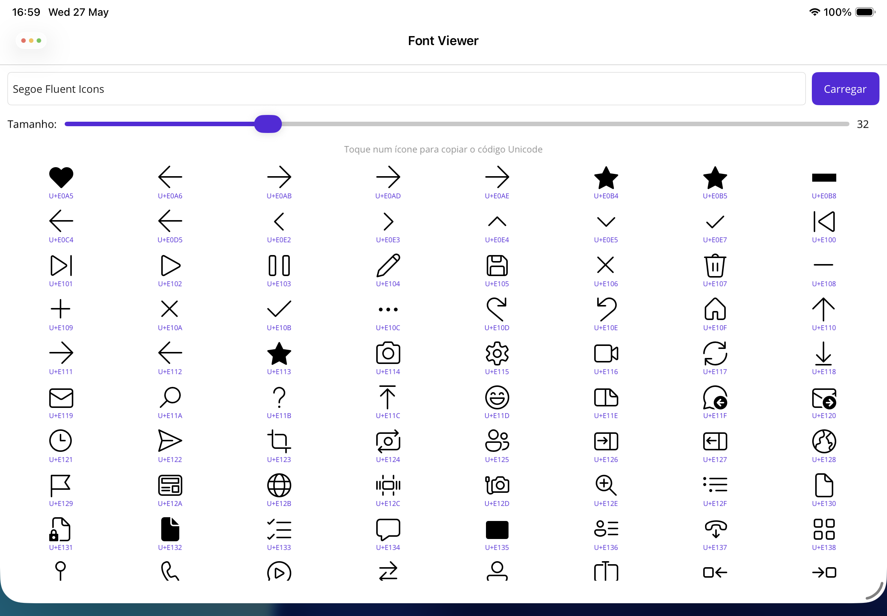

# FontViewer

A .NET MAUI app for browsing and inspecting icon font glyphs. Select a bundled font, view all available icons in a grid, and tap to copy Unicode codes to the clipboard.

## Features

- **Font selector** — switch between bundled icon fonts (Segoe Fluent Icons, Font Awesome 5, Material Symbols, Fluent System Icons)
- **Glyph grid** — displays all valid glyphs with their Unicode code and name (when available)
- **Tap to copy** — tap any icon to copy its Unicode code (e.g. `U+F2A7`) to the clipboard
- **Adjustable size** — slider to change icon size from 16 to 80px
- **Smart glyph detection** — uses SkiaSharp to detect only codepoints that actually map to a glyph in the font file
- **Glyph names** — parses the TrueType `post` table to extract human-readable glyph names

## Screenshots



## Requirements

- .NET 10
- .NET MAUI workload

## Getting Started

```bash
# Clone the repo
git clone <repo-url>
cd FontViewer

# Restore and build
dotnet restore
dotnet build

# Run on iOS Simulator
dotnet build -t:Run -f net10.0-ios -p:RuntimeIdentifier=iossimulator-arm64
```

## Bundled Fonts

| Font | File | Glyphs |
|------|------|--------|
| Segoe Fluent Icons | `segoe-fluent-icons.ttf` | ~1,437 |
| Font Awesome 5 Regular | `fontawesome-5-free-regular-400.ttf` | — |
| Material Symbols Outlined | `MaterialSymbolsOutlined.ttf` | — |
| Fluent System Icons Filled | `FluentSystemIcons-Filled.ttf` | ~9,583 |

## Tech Stack

- [.NET MAUI](https://dotnet.microsoft.com/apps/maui) — cross-platform UI
- [SkiaSharp](https://github.com/mono/SkiaSharp) — font glyph detection via `SKTypeface`

## License

MIT
